# Postman Shodan Collection

This Postman Collection contains all the available Shodan API calls.

The goal of this readme was to be detailed enough that people without Postman experience will have very little trouble getting everything to work. In order to reach that goal, lots of screenshots have been added.

While all the screenshots might help the novice user, they probably will make it more difficult for the more experienced user to find the relevant information in this readme; that's why a version without screenshots is available as well :

[Readme-without-visuals.md](Readme-without-visuals.md)

# Installation
* If you don't have Postman, please [download](https://www.getpostman.com/downloads/) and [install](https://learning.getpostman.com/docs/postman/launching-postman/installation-and-updates/) it.
* Next, download this repo and use the two included json files to import the Collection and set the Environment variables

## Importing the Collection
* Click on the **Import** button at the top left of the screen
* 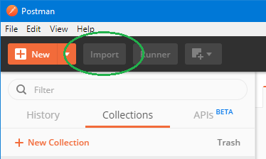
* Browse to where you have saved this repo on your hard disk and select the *Shodan.postman_collection.json* file
* When you have finished the Import, you will have a Collection called *Shodan* in the left pane. If the *History* tab is still selected, then click on the Collections tab to show it
* 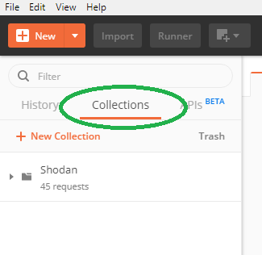
* Please note that at this point, nothing will work, until you import the necessary environment variables as well (see [next paragraph](#importing-the-environment-variables))

## Importing the Environment Variables
* Click on the gear-wheel at the top right of the screen; this opens a new window called *Manage Environments*
* 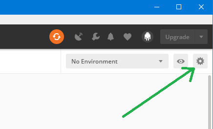
* Click on the **Import** button at the bottom of the popup window
* Browse to where you have saved this repo on your hard disk and select the *Shodan.postman_environment.json* file
* When you have finished this import, the Shodan environment will be shown in the popup window and you can close it (So, no need to click on the Add button)
* Now there is only 1 step remaining : [Setting your own API Key](#setting-your-api-key)

## Setting your API Key
* To be able to work with the Shodan API you need a (personal) API Key - a token that you send with every request which identifies you and allows you to do the request. When you [create an account](https://account.shodan.io/register) on the Shodan website, an API Key will be automatically assigned to you. You can view it by [logging in](https://account.shodan.io/); you can find it with your Account details
* On the top right of the screen - besides the gear-wheel icon, you can see an *eye* icon and a *drop down* menu. In the drop down menu, first select **Shodan**
* 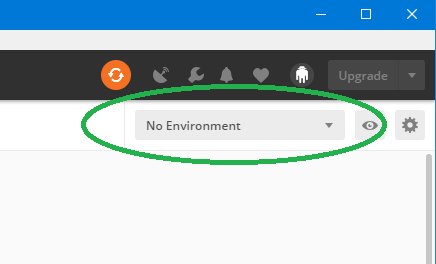
* 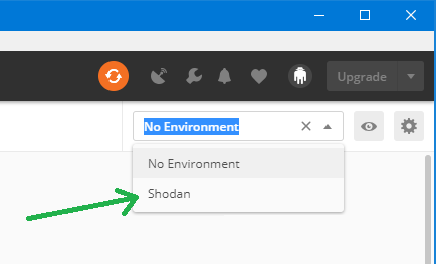
* Now open the Shodan Environment Variables by clicking on the *eye*. This will display all the environment variables for the Shodan collection.
* 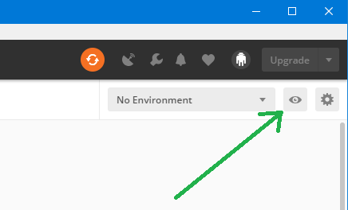
* Click **Edit** on the top right and a new popup window will appear that allows you to manage these variables.
* 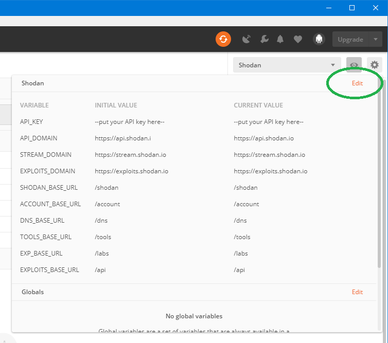
* The API_KEY variable should be displayed at the top and by default it has the value *'--put your API key here--'*. Replace this value for both the *Initial* and *Current* value with your own API key (so, log in to Shodan website and copy-paste it)
* 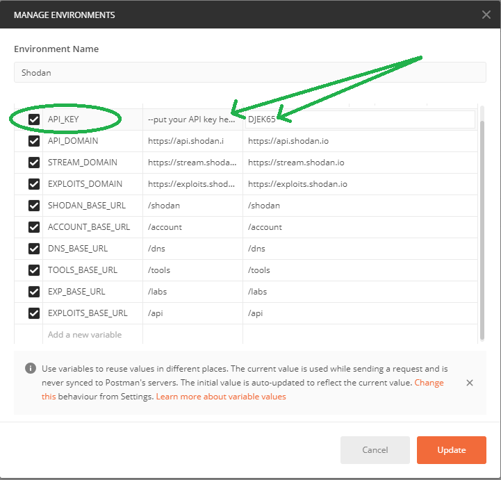
* When you have done this, click on the **Update** button and then close the popup window.
 
You are now all set to start interacting with the Shodan API!

# Using the Shodan Collection

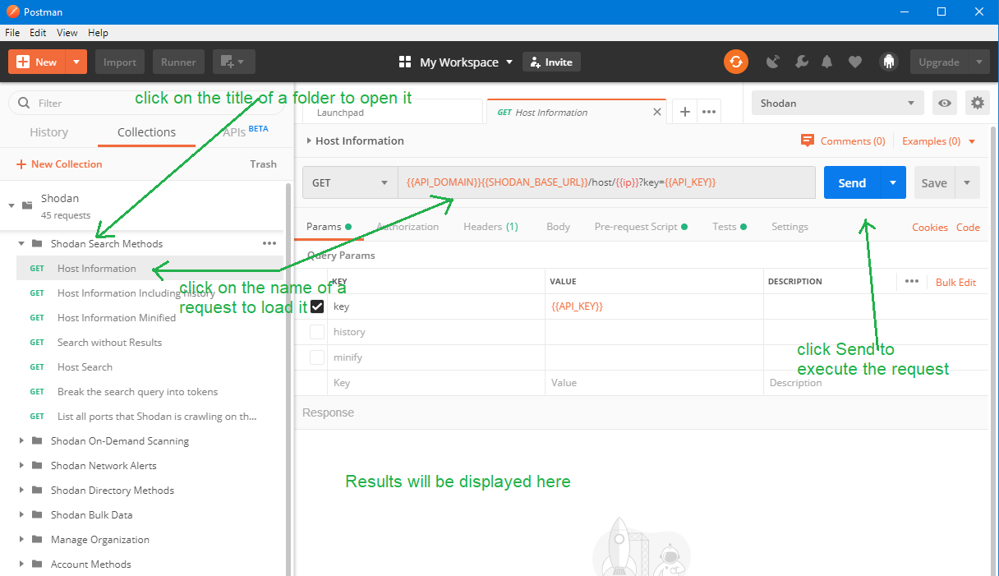

## Documentation of the calls
Every call has documentation, which is copied from the official documentation on the [Shodan website](https://developer.shodan.io/api). When you open a request by clicking the name in the left (navigation) pane, it will appear in a tab in the right (main) window pane. The first line in that pane displays the name of the call 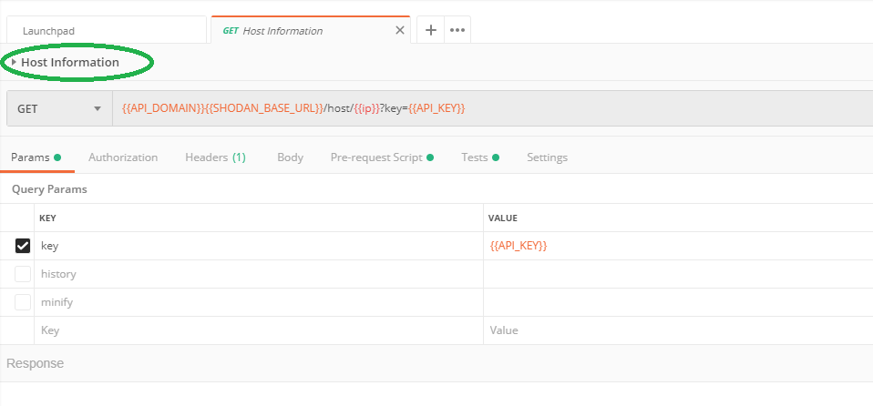 By clicking on it, the description will open. If there are parameters to be used with the request, they will be explained there. 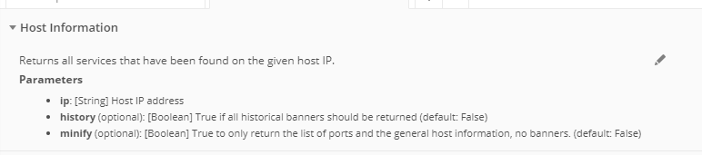

## Usage of variables
The Collection uses two different kinds of variables that can be distinguished based on their case; one is always *UPPERCASE*, the other always *lowercase*

### UPPERCASE variables
The uppercase variables are all ***Environment*** variables, which can be managed as explained in the [installation instruction](#setting-your-api-key). In practice, you will only need to change the value of the API_KEY. Changing the values of the other variables will likely break everything. So:

* don't change their values
* don't overwrite them with in the urls of the requests

In other words: don't touch the uppercase variables :-)

### lowercase variables
These are variables that allow you to interact with the api in a dynamic way. Contrary to the UPPERCASE variables, these you will ***have to*** change in order to make the request work. In all cases, they are used as *parameters*. See the (next) section about [Working with the Shodan api-parameters](#working-with-the-shodan-api-parameters) on how they are to be used

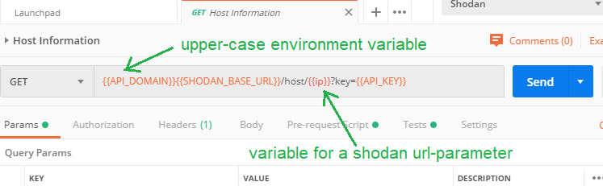

## Working with the Shodan api-parameters
Shodan has two types of parameters: ***url** parameters* & ***request** parameters*

### URL Parameters
The url parameters are always implemented as **lower-case** Postman variables. Any of the following three scenarios might apply to them:
* The variable will receive a value from a previous call. This happens for example when you create an alert: Shodan returns an id for that action and a *Script* will automatically run after the call and assign this value to the *alert_id variable*. So, when you then execute the details call afterwards, it will automatically retrieve the details for that alert. See the section about [Scripts](#scripts) to learn how they work
* The variable will receive a fixed or random default value if it hasn't been set. By means of a *Pre-request Script* (see [Scripts](#scripts)), a check is performed if a variable is still empty and if that is the case, a default value will be assigned to it. For example: the Host call to retrieve information about an ip that needs to be passed in the url. The Pre-request Script detects that {{ip}} doesn't have a value yet and will then generate a random ip address
* The variable will not receive a value at all. In order to make a valid call, you will need to replace the variable with a value.
    
In all cases, the *url parameters* can be substituted by fixed values. The ip parameter for example, is typically a parameter that you will set manually, thereby replacing the {{ip}} variable for a fixed value.

### Request Parameters
These are parameters that you can find in the ***Params** tab* or sometimes in the ***Body** tab*. 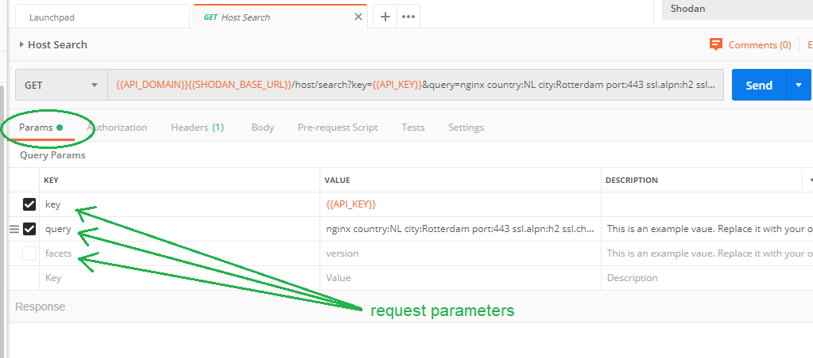 As with the url-parameters, you can find their usage in the description. What you need to know is:
* In some cases a default value has been provided as an example - you can simply overwrite them with whatever you like
* Optional parameters are also there, but not set. In the Params tab there is a checkbox in front of every parameter : when it's checked, the parameter (and its value) is included in the call and otherwise it's omitted. These optional parameters by default do not have the checkmark. (for example *facets* in the *Host Search* request)

## Debug information

### Console
Postman has a *'Console'*, which can be found at the bottom left of the screen, the icon that is on the right.   When a script is run, it might provide some information about what it has done. For example, if a random ip was generated for the {{ip}} variable, you will be able to find that value there.

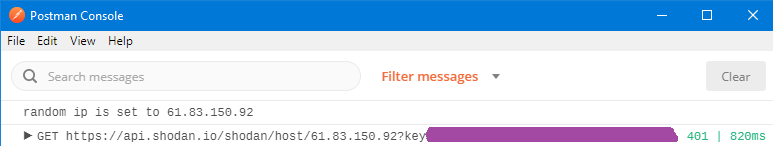

### Request Code
Another source for debugging (when it is not clear how the request was sent to Shodan), can be the **Code** link, which can be found completely on the right on the line just below the url of the request (below the blue *Send* button). This will show the call as it has been sent to Shodan.
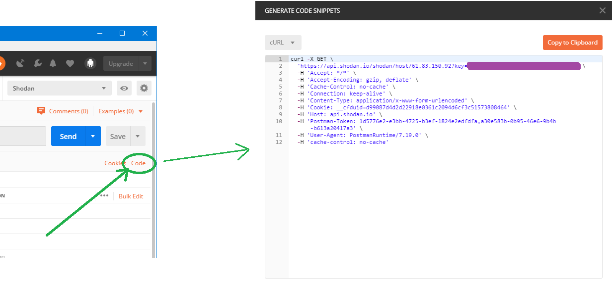

## Scripts
Some calls have ***Pre-request*** and ***Test*** Scripts. They are [documented extensively](https://learning.getpostman.com/docs/postman/scripts/intro-to-scripts/) on the Postman website, but in short: these are little scripts that run before and after the request has been executed. These scripts can interact with the variables, verify response data, etc.

When there is a Script (either Pre-request or Test) for a request, this is always indicated with a green bullet in that tab.
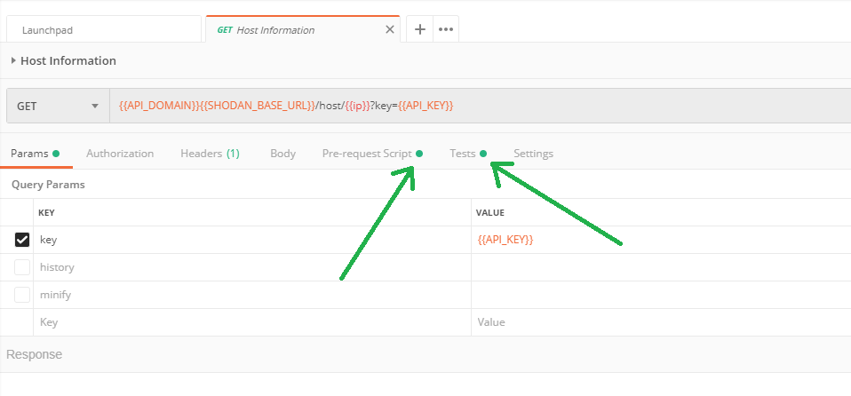

### Pre-request Scripts
The Pre-request scripts (in this collection) are always scripts that check if a variable (url-parameter) has a value and if necessary (when it doesn't) provide it with a default value. This is sometimes a random and sometimes a fixed value. All scripts of this type log this action to the *Console* (See [Debug information](#debug-information)).
*(Note : this script will always run, even if the variable is not used)*

### Test Scripts
Tests scrips are currently used for two purposes:
1. To set variables that are used in the collection with the value of a field from the response. For example: Shodan returns an id when an alert is created and then a Test script will assign this value to the *alert_id variable*. So, when you then execute the details call, it will automatically retrieve the details for that alert.
2. To populate templates for visualizations. See the [Visualize](#visualize) section for more information

## Visualize
All data from Shodan is returned in JSON format. While that is pretty readable already, it can have benefits to display this data using an html template. That way, you can filter what's important to you and structure it in such a way that it's easy to relate everything. In postman this is possible by:
1. Creating an html-template and populate it with the data from the response in a *Test Script* (see [Scripts](#scripts) section)
2. Viewing the results of that in the Visualize tab, which can be found just above the response pane. The *Host Information* call has an example of how this could work and can be used as an example to write your own custom Visualizations for other calls.

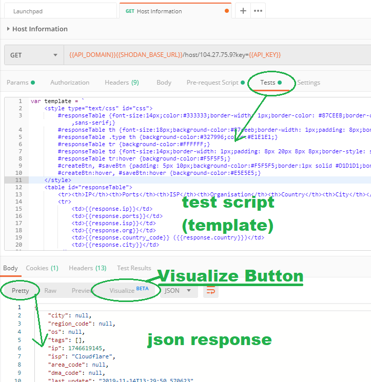

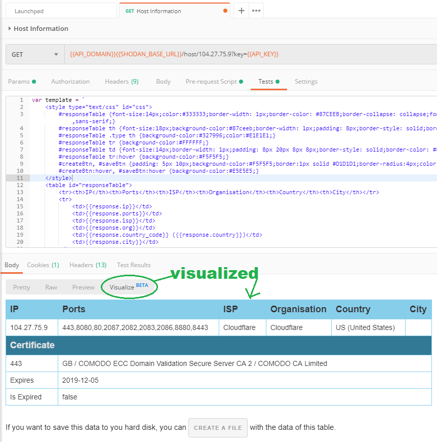

This example shows only a few fields; which fields you want to display and how is up to you.

Apart from a nice layout, the example also contains a way to save this custom visualization to your hard disk. How this works is explained in the (next) section [Saving Response Data](#saving-response-data)

## Saving Response Data
Response data can be saved in two ways: the native Save Response button (which stores all the json information that was returned) and a custom Save Button that saves the Visualization.

### Native Save Response
The native **Save Response** link can be found on the right hand side of the result pane. This will save the json response as it was returned by Shodan.

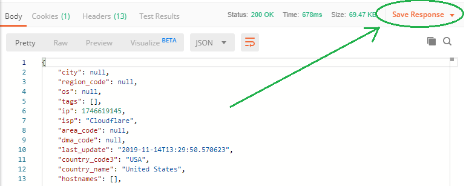

### Saving Visualizations
The example visualization contains a custom save button which has been written in Javascript. This is not Postman functionality, but something that has been written (by us) as part of this Collection. If you want to use it in other Visualizations then you will have to copy-paste the responsible code to that Visualization.

In order to save the Visualization, first click on the Create Button at the bottom.

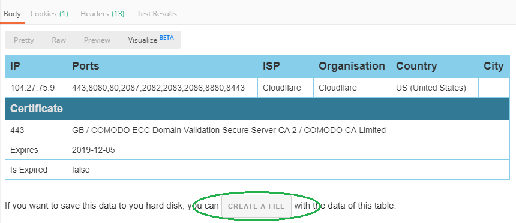

This will then prepare all the necessary output to be downloaded as a file; the Create Button will disappear when that is then and in it's place a Save Button will be displayed. Click it to get a popup asking you where you want to save the HTML file.

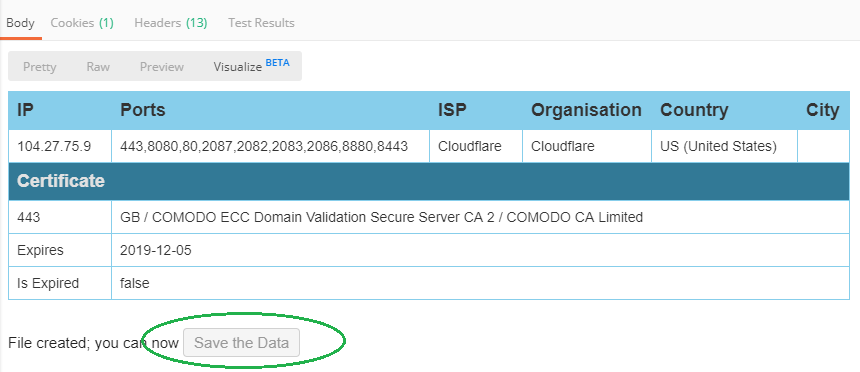

